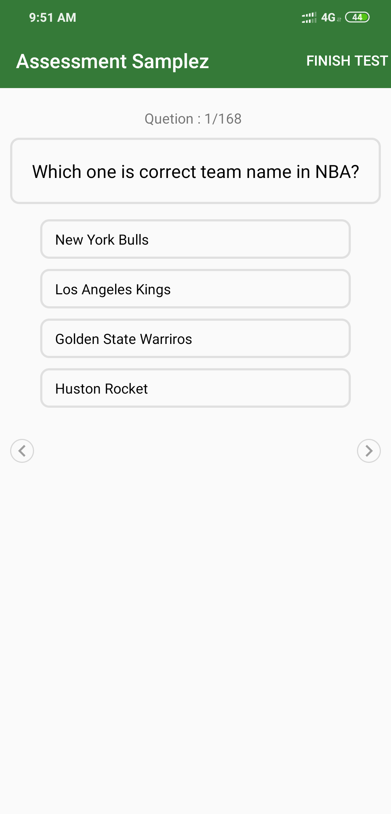

Insert question.json file in to internal memory

Sample JSON Object
{
"QuestionList":
    [
            {
                "question": "Which one is correct team name in NBA?",
                "options":
                 [
                            "New York Bulls",
                            "Los Angeles Kings",
                            "Golden State Warriros",
                            "Huston Rocket"
                 ],
                 "answer": "Huston Rocket"
            },
            {
                "question": "Question 2",
                "options":
                 [
                            "Option1,
                            "Option2",
                            "Options3",
                            "Options4"
                 ],
                 "answer": "Huston Rocket"
            }
    ]
}

